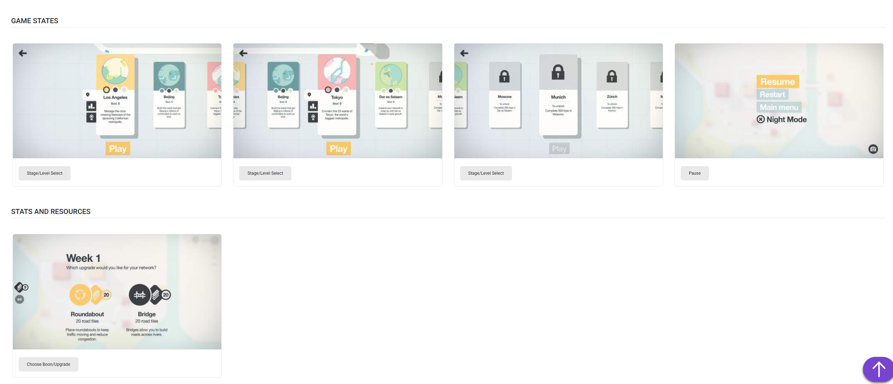
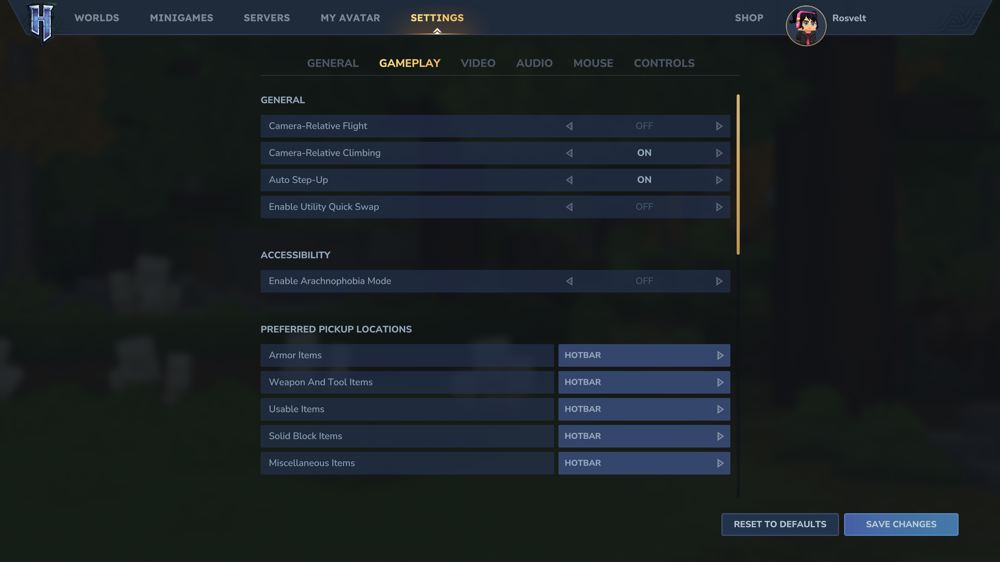

# UI / UX Direction

## Visual References

## Style Pillars
- **Soft grids + cards**: light grid texture on dark surfaces.
- **Rounded surfaces**: pill buttons, soft panels, low-elevation cards.
- **Readable contrast**: muted backgrounds, bright accent chips.
- **Playful clarity**: clean layout without clutter.

## Color + Type (Guidelines)
- **Base**: deep blue/charcoal background with slightly lighter panels.
- **Accents**: warm amber (primary), teal (secondary), violet (tertiary).
- **Type**: geometric sans, medium weight headings, roomy line-height.

## Layout Patterns
- **Left navigation rail** with major sections (Library, Profiles, Create, Settings).
- **Card grids** for featured mods and recent activity.
- **Split panels** for editing: list on the left, details on the right.
- **Context drawer** for quick actions (enable, export, restore).

## Component Inventory
- **Toggle chips** for enable/disable, profile selection, and filters.
- **Status badges** for Pack/Plugin/Early, conflicts, updates.
- **File tree** with expandable folders for pack structure.
- **JSON editor** with validation hints and quick templates.

## Motion
- 150–250ms ease-out transitions.
- Panel slides and subtle scale for focus changes.

## Dark Mode Only
- UI ships **dark mode only** and no theme toggle.
